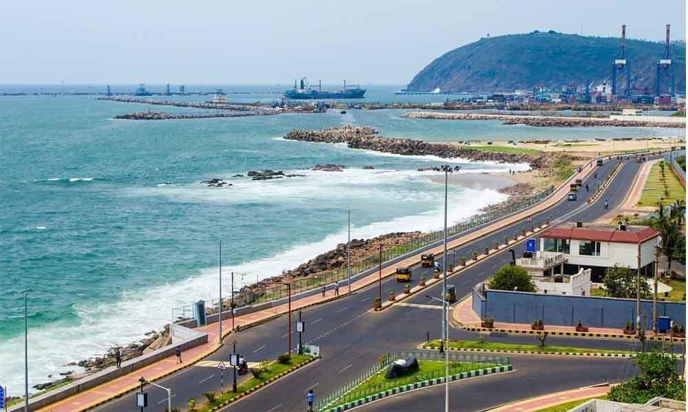

# assignment2-ghanta
# SAI CHARAN GHANTA
##### vizag

Vizag, also known as **Visakhapatnam** is the largest city and the proposed administrative capital of the Indian state of Andhra Pradesh.It is also the most populated city of the state. It lies between the Eastern Ghats and the coast of the Bay of Bengal.It is the second largest city in the east coast of India after Chennai and also the fourth largest city in South India. It is one of the four smart cities of Andhra Pradesh selected under Smart Cities Mission.
It also serves as the headquarters of Visakhapatnam district.With an estimated output of $43.5 billion, the city is the **ninth largest contributor to India's overall Gross domestic product as of 2016**.In 2020, Visakhapatnam emerged as the finalist in the World Smart City Awards under Living and Inclusion category.

***

### Direction from Maryville To Vizag

1. Travel in a car from Maryville to Kansas City
2. Catch a flight from Kansas city to Washington
3. Then connecting flight from Washington to Delhi
4. Flight from Delhi to Vizag
    1. If connecting flight is missed, Book a new flight from Delhi to Vizag 
    2. We Can travel via Road or Railway Transport
5. Reached my favourite place

- Currency
    - Debit card
    - Credit Card
    - Gpay, Phonepay
- Camera
- Authentic wear
- Friends and Family
- Famous restaurants
- Navigation routes to Historic places and beaches

[Click this link to open my Aboutme File](https://github.com/CharanGhanta/assignment2-ghanta/blob/a131eab0e013c87dceaf6b93e65fc7839e228c0d/AboutMe.md)

***

### Markdown Tables are used to represent food and drinks

| Food Items | Locality | Price |  
| :---: | :---: | :---: |  
| Bamboo Chicken | Araku | $10 |  
| Madugula Halwa | Madugula | $6 |  
| Chicken maggi | Rushikonda | $3 |  
| Grilled Kebabs | RK beach | $5 |  

***

# MY quotes

> Love the life you live, Live the life you love. -*Bob Marley*

> Knowledge speaks but wisdom listens. *-Jimi Hendrix*

> Life is what happens when you're busy making other plans. -*John Lennon*

***

### Code Fencing

The dot product (also called the scalar product) gives us the angle between any two vectors. It's one of the most important relationships between vectors. In this section we'll define the dot product and show how it gives the angle between vectors for two- and three-dimensional vectors.

[Link](https://xaktly.com/DotProduct.html)

ftype dot(point2d a, point2d b) {  
    return a.x * b.x + a.y * b.y;  
}  
ftype dot(point3d a, point3d b) {  
    return a.x * b.x + a.y * b.y + a.z * b.z;  
}  

[Link](https://cp-algorithms.com/geometry/basic-geometry.html)

